

Full stack e-commerce app Like amazon using React Next.js and MongoDB

<h2>🚀 Demo</h2>

[ecommerce-amazon.vercel.app](https://ecommerce-amazon.vercel.app/)

## Tech Stack

**Client:** React, nextjs, TailwindCSS
**Server:** Nextjs, mongodb
**Anther:** react hook form, next-auth, react-toastify, react-paypal, js-cookie

## Features

- user authentication
- paypal payment
- next js crud operations
- form validation
- responsive design
- place order steps
- shipping cart

## Screenshots

|                                              |                                              |
| -------------------------------------------- | -------------------------------------------- |
| 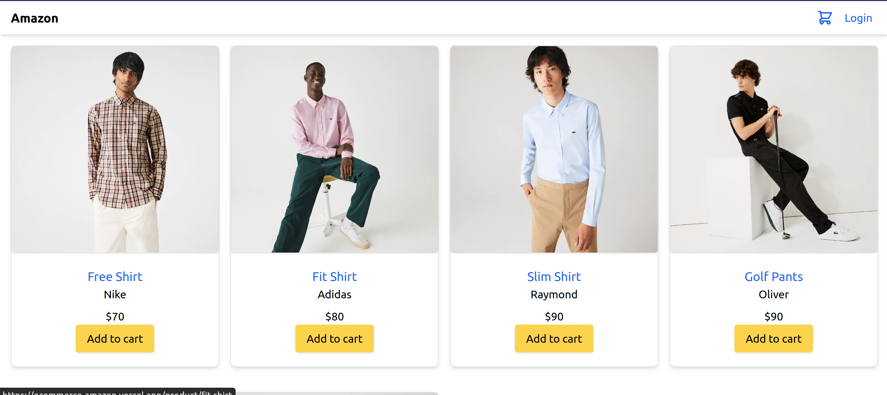  | 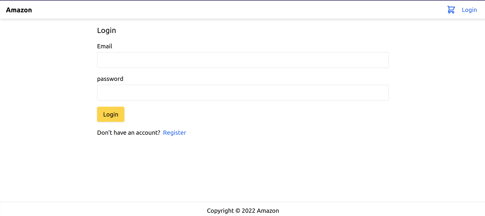  |
| 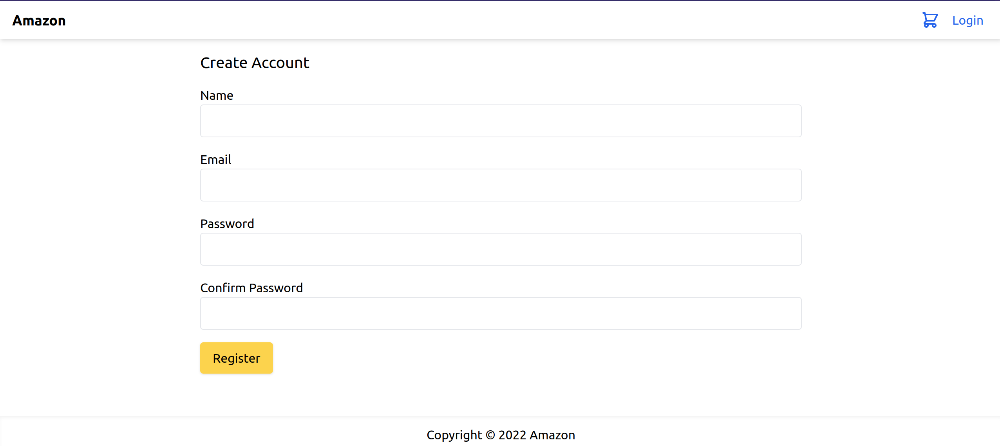  | 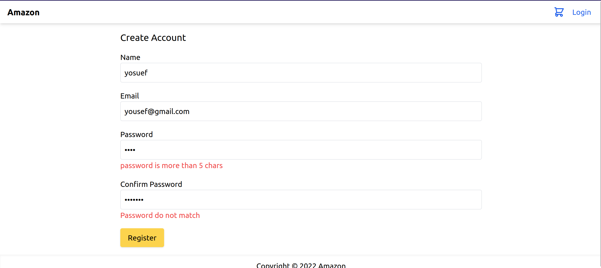  |
| 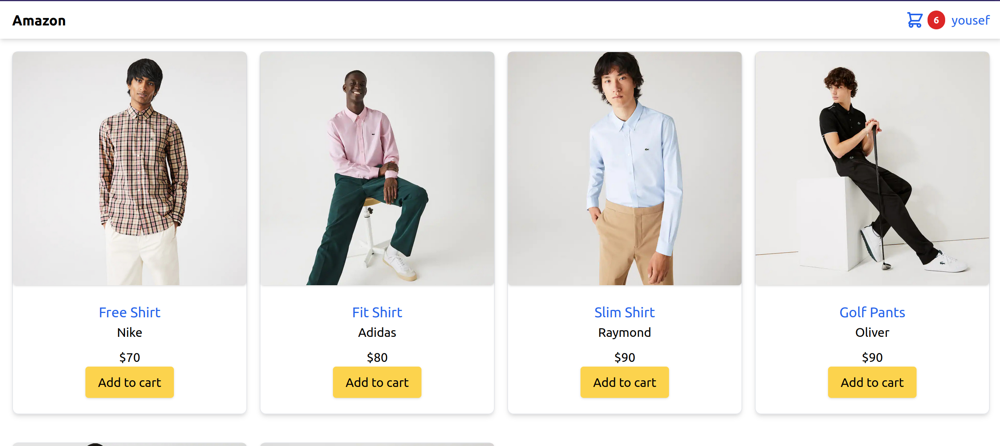  | 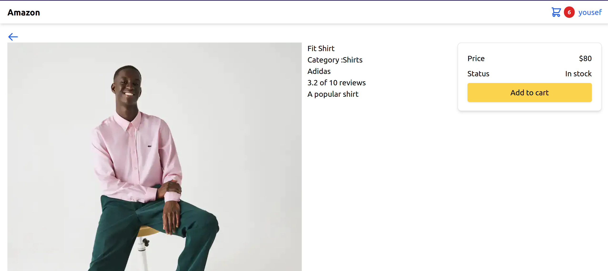  |
| 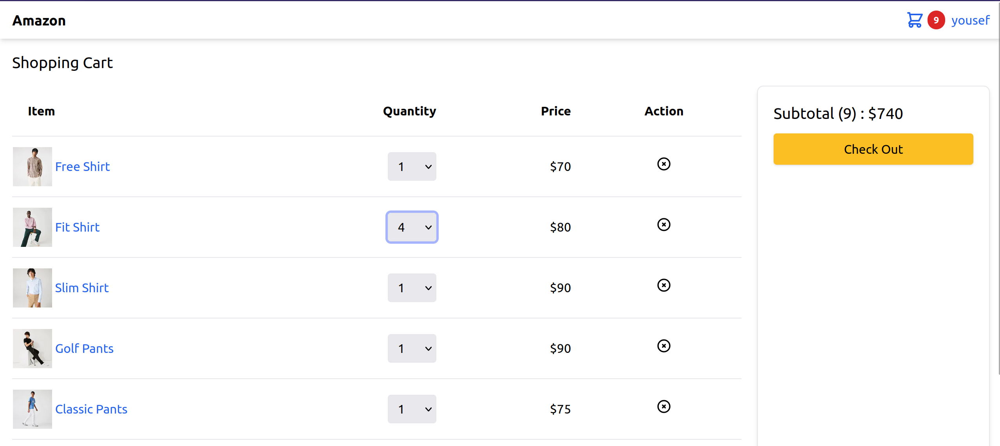  | 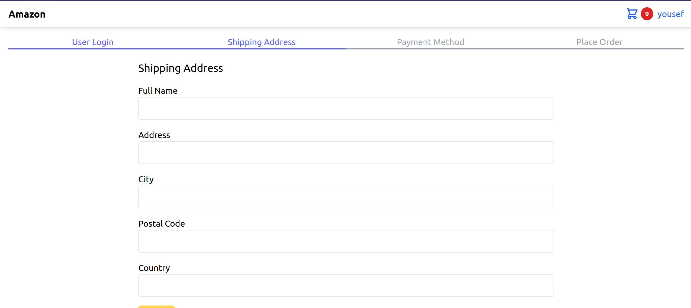  |
| 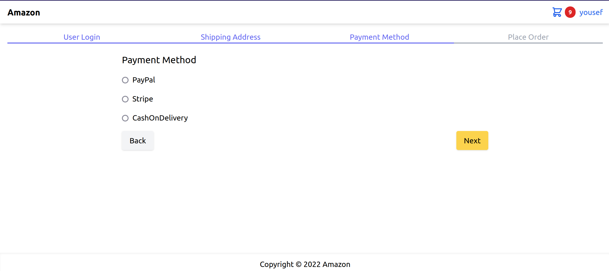 | 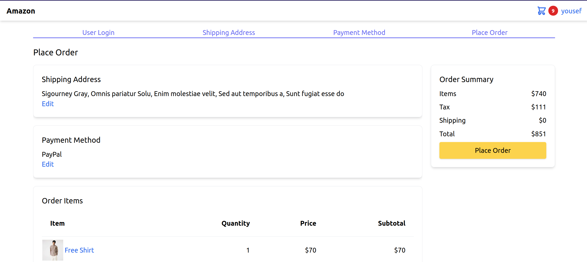 |
| 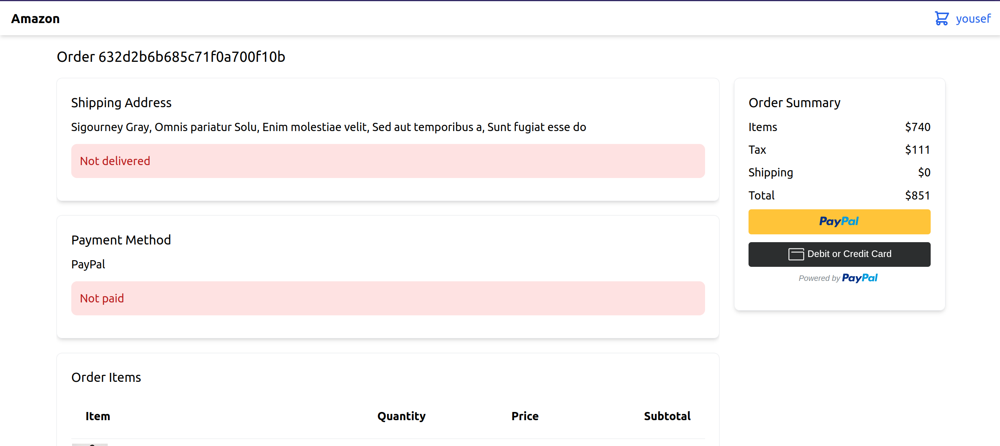 | 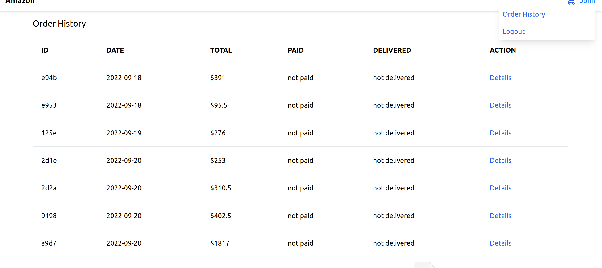 |
| 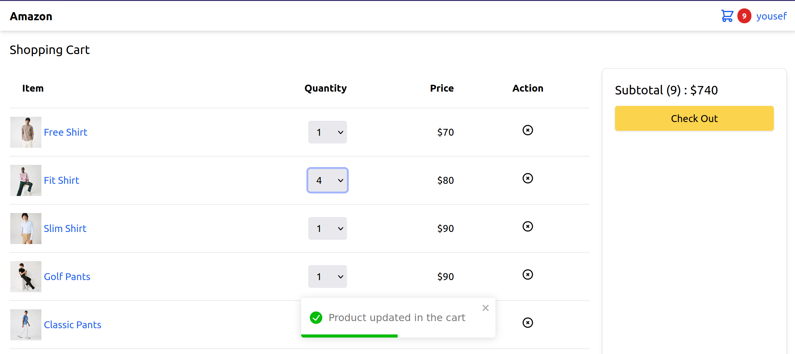  | 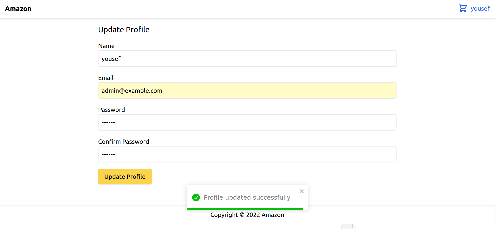 |
